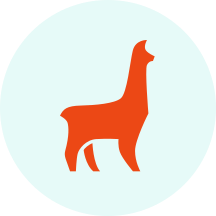

<p align="center">
  <a style="padding-right: 16px;" href="https://tinacms.org">
    
  </a>
  <a href="https://www.nextjs.org/">
    
  </a>
</p>
<h1 align="center">
  piotrepro blog
</h1>

Based on [TinaCMS](https://tinacms.org) with [Next.js](https://nextjs.org/)

## About

Simple blog template based on Next.js and TinaCMS – Meta data for CEO/Social media sharings, Disqus comment sections, Calculate the estimated reading time of an article(russian)

## Quick Setup

#### _Set-up Locally_

In your terminal, navigate to where you would like this blog to live, then run

```bash
#clone the repo
git clone git@github.com:PyotrLogvinenko/piotrepro-blog-master.git

#navigate to the directory
cd brevifolia-next-tinacms

#install dependencies & run dev server with yarn
yarn install
yarn develop

#or with npm
npm install
npm run develop
```

This will start a dev server, navigate to localhost:3000. **Note** that the script `dev` doesn't start the git server which you need running to use Tina locally. Use `develop` whenever trying to make edits with Tina.

## Project Structure

- Site-level configuration is stored in `data/config.json`. This is editable by Tina when you are on the home page.
- your URL can be edit here `data/index.js`.
- Edit styles within each component or page file within the `<style jsx>` tags.
- Global styles live in the `Meta` component.
- `posts/`contains all your markdown blog posts.
- `static/` is where you images live and will get uploaded.
- `pages` is where you page components live.
- The blog pages are dynamically generated with a `slug` parameter. See the template in `pages/blog/[slug].js`.
- The pages & template are comprised of components from `components`.
- The routes are generated in `next.config.js` with `exportPathMap`.
